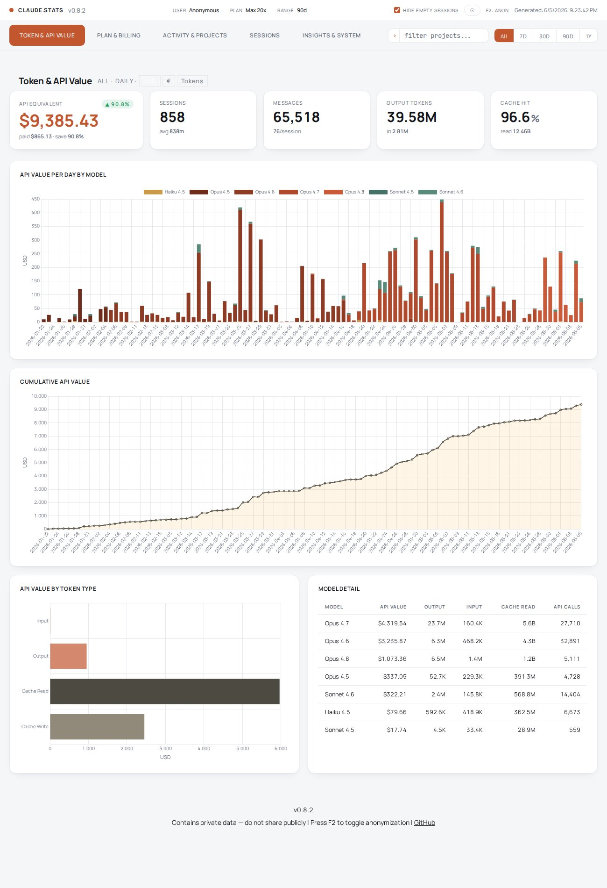
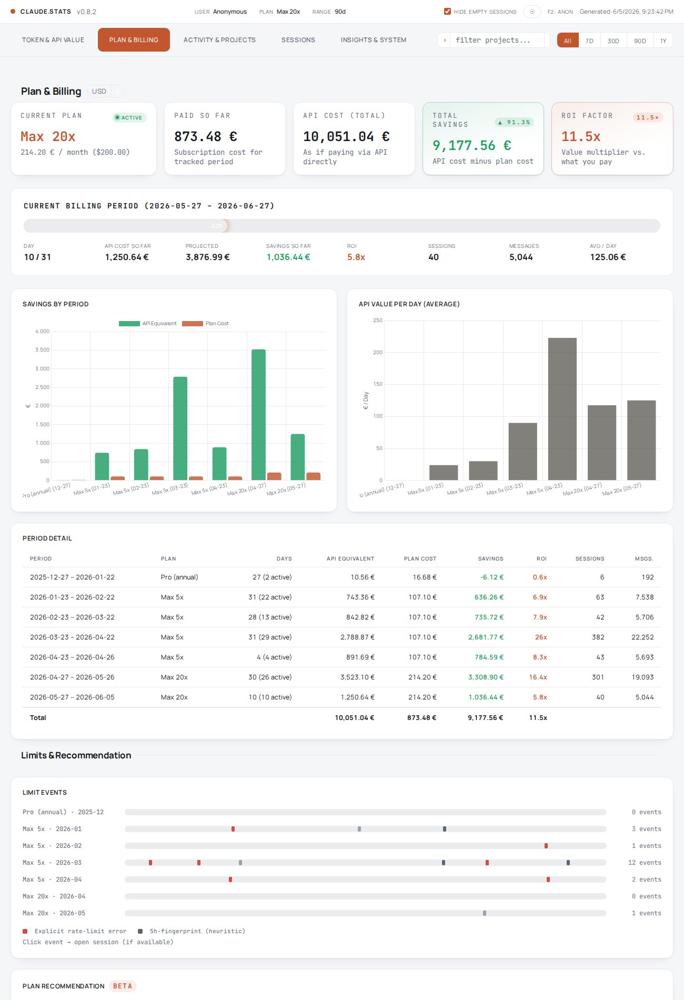
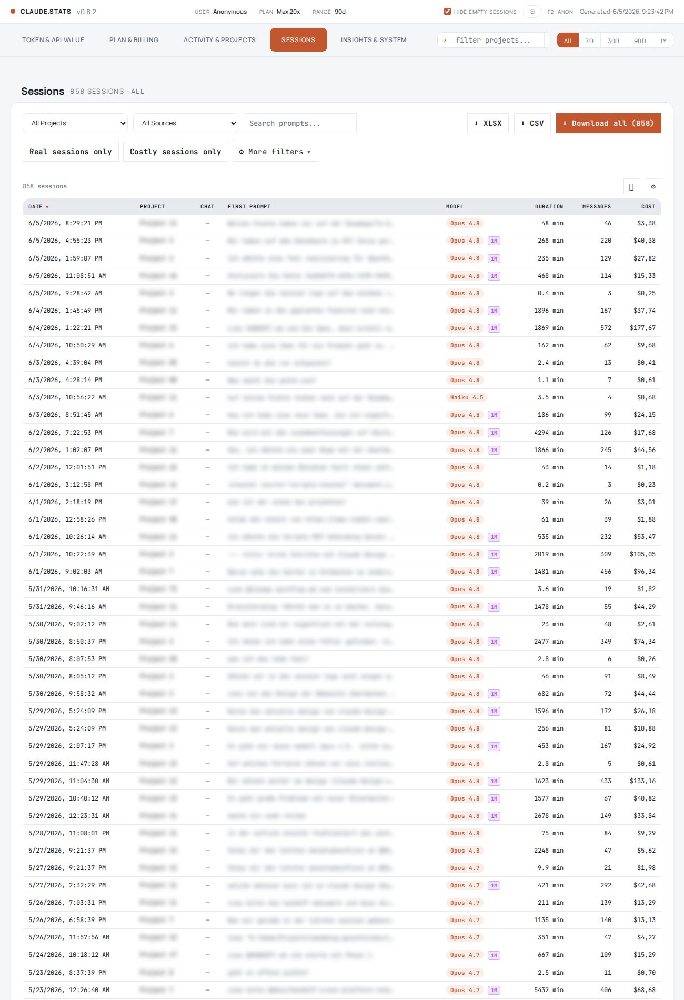
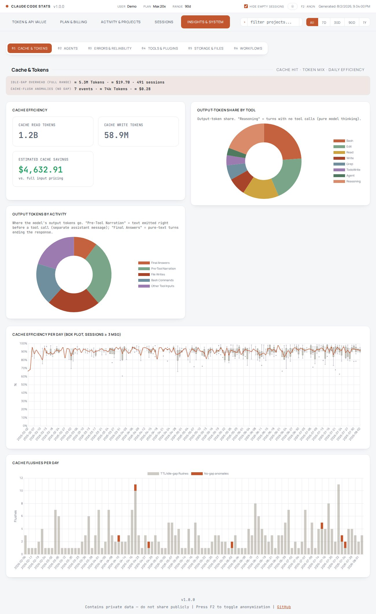

# Claude Code Usage Statistics

A self-hosted analytics dashboard for [Claude Code](https://docs.anthropic.com/en/docs/claude-code). Parses your local session transcripts, calculates hypothetical API costs, and generates an interactive HTML dashboard.

**_Disclaimer:_** _Unofficial, community-built tool. Not affiliated with or endorsed by Anthropic._

## What you get

<table>
  <tr>
    <td><a href="docs/images/claude-code-stats-01.jpeg"></a></td>
    <td><a href="docs/images/claude-code-stats-02.jpeg"></a></td>
  </tr>
  <tr>
    <td><a href="docs/images/claude-code-stats-06.jpeg"></a></td>
    <td><a href="docs/images/claude-code-stats-07.jpeg"></a></td>
  </tr>
</table>

Highlights:

- **Five focused tabs** - Token & API Value, Plan & Billing, Activity & Projects, Sessions, Insights & System; card-based interface with light / dark themes
- **Cost & token analytics** - API-equivalent cost, full token breakdown (input / output / cache-read / cache-write), cache efficiency, plan vs. actual usage
- **Metric toggle** - Switch the daily and cumulative charts between USD, your billing currency, and consumed tokens (input + output); the money KPI follows along
- **Cache health & anomaly detection** - Idle-gap (TTL) overhead tracking plus detection of no-gap cache invalidations like the 2026 Claude Code cache bugs, with a per-day flush chart as an early-warning signal
- **Session replay & table** - Interactive node-graph with timeline playback, plus a searchable, sortable session table with CSV / XLSX / Markdown / ZIP export
- **Multi-attribute filtering** - Range sliders for tokens, cost, duration, tool calls, agent dispatches, errors; one-click presets and persistent state across reloads
- **Limits & plan recommendation (beta)** - Detects rate-limit and server-overload events from transcripts, 5-hour rolling-window tracker, empirically calibrated plan-tier suggestion
- **Per-tool token attribution** - Output tokens and cost broken out by tool per session, plus a separate reasoning bucket; live-recomputed donut on the dashboard
- **Privacy** - F2 anonymization mode for screenshots, `--no-memories` flag to exclude project memory content
- **Theming** - Light / dark / system theme, optional `custom.css` recolors the UI and charts live without touching source
- **Multi-user / migration** - Merge multiple `~/.claude` directories or import data from old machines; automatic session deduplication

<details>
<summary><b>Full feature list</b></summary>

#### Filtering & navigation

- Global time-range filter (All / 7D / 30D / 90D / 1Y) and project search across the whole dashboard
- Plan-cost reference rescales proportionally to the selected range
- Hash-based deep links for tabs (e.g. `index.html#sessions`) survive a full page reload
- Mobile-responsive layout; data tables become stacked, labeled cards on small screens
- Universal column sorting on every data table; resizable columns (drag to size, double-click to auto-fit) on the project and plans tables

#### Token & API Value

- KPI band at the top of the tab: API equivalent (with savings delta), sessions, messages, output tokens, cache hit rate
- Metric toggle **USD / billing currency / Tokens** for the daily by-model chart and the cumulative chart: the token view counts input + output (cache excluded), the currency view converts with your per-billing-cycle exchange rate, and the API-equivalent KPI follows the selected currency
- Daily API value by model (stacked), cumulative curve, API value by token type, model detail table
- Daily and cumulative series are bucketed by the day work actually happened: a session spanning midnight has its tokens, cost, and messages split across the real calendar days
- Estimated-pricing notice when a model in your data is missing from the price table

#### Plan & Billing

- Cost savings analysis vs. your subscription plan: savings, ROI, and cost-per-day per billing cycle
- Per-billing-cycle slicing (monthly cycles even for annual plans)
- In-progress billing period framed with its real end date, spend so far, and a projected end-of-cycle API value / ROI
- USD / local-currency toggle
- Limits timeline integrated into the tab, so rate-limit events appear in billing context

#### Activity & Projects

- GitHub-style activity heatmap
- Message patterns: hourly, weekday, daily messages and sessions in one dual-axis chart; hour-of-day and weekday are attributed to each message's actual local timestamp, so off-hours and multi-day sessions land in the right bucket
- Top projects table with per-project detail pages including memories and workflow timeline

#### Sessions

- Expandable filter panel with range sliders + number inputs for tokens, cost, duration, message count, cache efficiency, tool calls, agent dispatches, errors
- One-click presets ("long sessions", "high-cost sessions", etc.)
- Free-text search across project / session id
- Active-filter chip row with per-chip clear; state persists across reloads
- Sortable, resizable session table; sessions that span more than one calendar day are badged in the date column
- Per-session detail pages with chat replay and Markdown / CSV / XLSX / ZIP export
- Per-session cache-efficiency badge and flush counter
- Chat replay marks errors, compactions, slash commands, interrupts, and rejected tool calls; multi-select event filters, a thinking indicator, and output tokens attributed to each slash command
- Chat replay inserts day-divider rows for multi-day sessions, and the date carries into the copy-to-clipboard and Markdown exports

#### Session flow visualization

- Interactive canvas-based replay with node graph and particle animations
- User node + bidirectional message flow, Chat node with wait-time indicator
- Play/pause timeline (starts paused), fullscreen mode, live message and tool-call counters
- Theme-aware canvas (grid, nodes, icons switch with the theme)

#### Token attribution

- Per-tool output tokens and cost split per session, plus a separate reasoning bucket
- Dashboard donut for tool-share that recomputes live when filters change
- Largest-remainder allocation prevents fractional drift across many small turns

#### Plan & billing

- Cost savings analysis vs. your subscription plan
- Per-billing-cycle slicing (monthly cycles even for annual plans)
- Local-currency display alongside USD

#### Limits (beta)

- Rate-limit and server-overload events detected from transcripts; legend distinguishes explicit API markers from heuristic signals
- 5-hour rolling-window tracker (matches Anthropic's enforcement)
- Weekly hit-count summary
- Idle-gap correlation with short / medium / long buckets
- Plan-tier recommendation with empirical per-day calibration

#### Insights & System

- Numbered sub-navigation: Cache & Tokens, Agents, Errors & Reliability, Tools & Plugins, Storage & Files, Workflows
- Cache & Tokens: cache-efficiency KPIs and per-day box plot, output-token share by tool, output tokens by activity, plus the cache anomaly card (idle-gap overhead and no-gap flush events) and a "Cache Flushes per Day" chart
- Cache anomaly detection separates TTL/idle-gap flushes from no-gap invalidations (the cache was rebuilt although it cannot have expired - the pattern behind the 2026 Claude Code cache bugs); compaction rebuilds are excluded to avoid false alarms
- Agents: subagent type and dispatch distribution, task overview
- Errors & Reliability: error breakdown by source (backend / tool / user / hook), category, and tool
- Tools & Plugins: tool usage, installed plugins
- Storage & Files: storage breakdown, file snapshots, todos
- Workflows: plan-mode plans table, skills and hooks, git operations

#### Theming

- Light / dark / system theme toggle
- Optional `public/custom.css` overrides colors and fonts; the example file ships every build, and accent changes recolor the UI and charts live without a rebuild

#### Privacy

- F2 anonymization mode (extends to source labels, plan titles, skills, hooks, project memories)
- `--no-memories` flag excludes project memory content from the build
- Configurable display name, empty-session filter, optional Session Flow hide-switch

</details>

## Quick Start

1. **Clone the repository**

   ```bash
   git clone https://github.com/AeternaLabsHQ/claude-code-stats.git
   cd claude-code-stats
   ```

2. **Create your configuration**

   ```bash
   cp config.example.json config.json
   ```

   Edit `config.json` to match your subscription plan and preferences.

3. **Run the extractor**

   ```bash
   python3 extract_stats.py
   ```

4. **Open the dashboard**
   ```bash
   open public/index.html      # macOS
   xdg-open public/index.html  # Linux
   start public/index.html     # Windows
   ```

## Configuration

See [`config.example.json`](config.example.json) for all options:

| Key                  | Type     | Default     | Description                                                                  |
| -------------------- | -------- | ----------- | ---------------------------------------------------------------------------- |
| `language`           | `string` | `"en"`      | UI language (`"en"` or `"de"`)                                               |
| `display_name`       | `string` | `""`        | Account name shown in the dashboard header (overrides the auto-detected one) |
| `source_label`       | `string` | `"current"` | Label for the local `~/.claude` source in session metadata                   |
| `hide_session_flow`  | `bool`   | `false`     | Hide the Session Flow visualization (for screenshots/recordings)             |
| `plan_history`       | `array`  | `[]`        | Your subscription plan history                                               |
| `plan_capacity_override_pro_usd` | `number` | `null` | Manual per-window USD capacity of the Pro tier for the plan recommendation; overrides the empirical calibration (Max 5x / 20x scale ×5 / ×20) |
| `migration.enabled`  | `bool`   | `false`     | Enable data from a migration backup                                          |
| `migration.label`    | `string` | `""`        | Label for migrated sessions (e.g. `"archive:laptop"`)                        |
| `migration.dir`      | `string` | `null`      | Path to migration backup directory                                           |
| `additional_sources` | `array`  | `[]`        | Extra `~/.claude` directories to merge (multi-user)                          |

### Plan History

Each entry in `plan_history` represents a subscription period:

```json
{
  "plan": "Max 20x",
  "start": "2026-04-27",
  "end": null,
  "cost_local": 214.2,
  "currency_symbol": "€",
  "cost_usd": 200.0,
  "billing_day": 27,
  "billing_cycle": "monthly"
}
```

- `end: null` means the plan is currently active
- `cost_local` + `currency_symbol` are display values (what you actually pay, in any currency). The legacy field `cost_eur` is still accepted as a fallback
- `cost_usd` drives the savings / ROI math against API-equivalent value
- `billing_day` determines billing cycle boundaries for cost analysis
- `billing_cycle` is `"monthly"` (default) or `"annual"`. Annual plans are sliced into 12 monthly cycles so a yearly upfront payment doesn't dominate a single chart bar

### Migration Support

If you migrated Claude Code data from another machine, you can include that historical data:

```json
{
  "migration": {
    "enabled": true,
    "dir": "~/backups/old-machine",
    "claude_dir_name": ".claude-windows",
    "dot_claude_json_name": ".claude-windows.json"
  }
}
```

The script deduplicates sessions across both sources automatically.

### Multi-User / Additional Sources

To include Claude Code data from other users on the same machine (or any additional `~/.claude` directory), add them to `additional_sources`:

```json
{
  "additional_sources": [
    {
      "label": "alice",
      "claude_dir": "/home/alice/.claude",
      "dot_claude_json": "/home/alice/.claude.json",
      "sudo_user": "alice"
    }
  ]
}
```

- `label` - Identifies the source in session metadata
- `claude_dir` - Path to the user's `.claude` directory
- `dot_claude_json` - _(optional)_ Path to their `.claude.json` file
- `sudo_user` - _(optional)_ Run reads from this source as the given user via passwordless `sudo` (useful when the running user has no direct read access; requires a sudoers rule)

When `sudo_user` is omitted the running user needs direct read access to the referenced directories. Sessions are deduplicated and all data (sessions, plans, todos, telemetry, etc.) is merged into the dashboard.

## Custom Styling

You can recolor the dashboard without editing the source. Every build ships `public/custom.css.example` with the full list of overridable design tokens (the new design plus the legacy chart variables) for light, dark, and `prefers-color-scheme`.

```bash
cp public/custom.css.example public/custom.css
# then edit public/custom.css
```

The generated pages load `public/custom.css` _after_ the inlined stylesheet, so any rule you put there wins the cascade. The builder only creates `public/custom.css` when it does not already exist, so your edits survive every rebuild.

> [!IMPORTANT]
> Theme variables are scoped to `html.theme-light .vc`, `html.theme-dark .vc`, and `body.vc-page`. Target those selectors (not bare `.vc`) or your overrides will lose specificity to the built-in theme rules. The example file shows the right shape.

## Output

The script generates files in the `public/` directory:

- `index.html` - Self-contained interactive dashboard (open in any browser)
- `dashboard_data.json` - Raw aggregated data (for custom analysis)

## Automation

To auto-refresh the dashboard periodically:

```bash
*/10 * * * * cd /path/to/claude-stats && python3 extract_stats.py 2>&1 >> update.log
```

## Security & Privacy

> [!WARNING]
> The generated dashboard may contain **sensitive data**: source code snippets, file paths, API keys, project memories, conversation history, and internal notes. **Do not publish the output to the public internet or any unsecured location.** Use authentication or keep it local. Use `--no-memories` to exclude project memory content. Press `F2` in the dashboard to toggle anonymization mode for screenshots.

## Preventing Claude Code from Deleting Session Data

Claude Code **automatically deletes session transcript files older than 30 days** on every startup ([docs](https://docs.anthropic.com/en/docs/claude-code/overview#application-data)). Your `history.jsonl` (prompt recall) is kept, but the detailed JSONL transcripts in `~/.claude/projects/` - which this dashboard depends on for cost calculation, token breakdowns, and session replay - are permanently removed.

To preserve your data, add `cleanupPeriodDays` to your `~/.claude/settings.json` ([settings reference](https://docs.anthropic.com/en/docs/claude-code/settings#available-settings)):

```json
{
  "cleanupPeriodDays": 99999
}
```

> [!CAUTION]
> Without this setting, you will silently lose historical session data every time Claude Code starts. There is no recovery mechanism - once the files are deleted, the cost and token data they contained is gone. If you use `additional_sources` or `migration`, apply this setting on every machine.

> [!NOTE]
> Do not set the value to `0` - this disables transcript persistence entirely ([#23710](https://github.com/anthropics/claude-code/issues/23710)). The minimum allowed value is `1`.

## Requirements

- Python 3.8+
- No external dependencies (stdlib only)
- Claude Code installed with session data in `~/.claude/`

## Localization

The dashboard supports English and German. Set `"language": "en"` or `"language": "de"` in your `config.json`.

To add a new language, create a file in `locales/` following the structure of [`locales/en.json`](locales/en.json).

## Changelog

See [`CHANGELOG.md`](CHANGELOG.md) for the full release history.

## License

[GNU Affero General Public License v3.0](LICENSE) (AGPL-3.0).

If you run a modified version of this dashboard on a network server (e.g. host the generated `public/` directory behind a public URL), the AGPL requires you to make the corresponding source code available to users who interact with it over the network.
